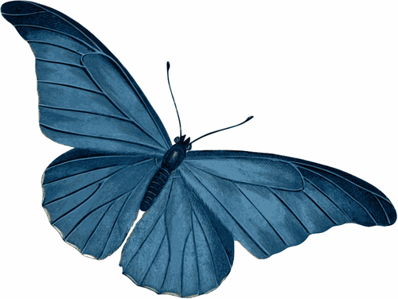

<p align="center">
    
</p>

# QButterfly
QButterfly is a lightweight approach to embed websites into Qualtrics surveys and observe user behavior. It can be used to track user behavior on single websites or in online experiments (e.g. in controlled usability experiments). 

Qualtrics is used to conveniently manage the overall study flow including consent, random assignment of participants to treatments, manipulation checks, etc. The stimulus website is embedded into Qualtrics via an iframe. Currently, Butterfly can track only user clicks on a stimulus website. Clicks are then stored in a Qualtrics question and can be easily analyzed afterwards. It is therefore not required to manually match a users's survey inputs with other behavioral data (e.g., server logs, analytics tools) after the survey.

A demo of QButterfly is available [here.](https://immzhaw.eu.qualtrics.com/jfe/form/SV_887kj9vYpIqnBfU) 

## Quick start

### Import qbutterfly_template.qsf

Start by [importing](https://www.qualtrics.com/support/survey-platform/survey-module/survey-tools/import-and-export-surveys/) qbutterfly_template.qsf in Qualtrics. 

Your website https://www.mywebsite.com/index.html will be display as an window within the Qualtrics survey window ("iframe"). Therefore, switch to [survey flow](https://www.qualtrics.com/support/survey-platform/survey-module/survey-flow/survey-flow-overview/) and update the following variables:
- windowURL (url of your website, e.g., https://www.mywebsite.com/index.html)
- windowBorder (border size of window)
- windowHeight (height of window)
- windowWidth (width of window)
- windowScroll (scrollbars yes or no)

### Embed QButterfly in website

First, deploy your webpage and embed butterfly. For an example see butterfly_example.html in the example folder.

Add JQuery and qbutterfly.js to each html page. Afterwards add an id (e.g., "MyLink") to the objects you want to track. Replace https://abcd.eu.qualtrics.com with the name of your own Qualtrics domain that you are using to run surveys. The following code will react on a click on a hyperlink with the id MyLink. 

```html
<head>
 <title>demo</title>
     <script src="https://ajax.googleapis.com/ajax/libs/jquery/3.6.0/jquery.min.js"></script>
     <script type="text/javascript" src="qbutterfly.js" qualtricsURL="https://abcd.eu.qualtrics.com"></script>    
</head>
<body>
    <a id="MyLink" href="https://www.w3schools.com/">Visit W3Schools.com!</a>
</body>
```
If you want to assure that the user is only able to see the webpage when it is fully loaded and cannot interact with it beforehand additionally add the following line of code.

```html
<head>
    <style>html { visibility:hidden; }</style>
 ...
</head>
```
QButterfly will then switch the page to visible once the window.onload event is fired, i.e. all css, images etc. are loaded.

### Re-enable the Qualtrics next button after website presentation

When your website is presented via Qualtrics the next button of your survey is hidden by default. If you want to always display the next button, remove the following line of code from the JavaScript of the "Website" question in Qualtrics.

```javascript
this.hideNextButton();
```

To display the next button after it was hidden you have two options.

By default the next button is displayed automatically after 30 seconds. Remove the following line if you want to manually active the next button or change the value 30000ms by any other meaningful duration.

```javascript
setTimeout(function() { jQuery("#NextButton").show(); },30000);
```

You can also activate the next button via a specific user click on your website.

Simply add the class "enableNextButton" behind "reactOnClick" in your html code.

```html
<a id="MyLink" class="enableNextButton" href="https://www.w3schools.com/">Visit W3Schools.com!</a>
```

### Test the study, run it and analyze the data

Make sure to test your study with multiple browser types / screen resolutions before you run your study. Carefully check the recorded click trails in a soft launch of your study (e.g. 5% of your intended sample). 

QButterfly writes the data to the embedded variable named "collectedData". In Qualtrics you can retrieve it any time via ${e://Field/collectedData}. 

This is an example of the format of the recorded data:

```html
1630841029899#ready_control.html; 1630841029900#load_control.html; 1630841031050#Button1; 1630841031978#Checkbox1; 1630841033034#Button2; 1630841033870#UndefinedClick;
```

Each event comes with a timestamp (milliseconds since 01.01.1970 00:00:00 UTC) and an event ID (e.g., 1629802677011#Button2) separated by #. Events are separated via ";". Each webpage will generate an event with its name when a) its ready ("ready_ ...") and a user can interact and afterwards b) all images, etc. are fully are loaded ("load_..."). Each click on an element will generate an event, too (e.g., 1629802676308#Button1). If the html elments do not have an ID tag assigned to them these events will be "UndefinedClick".

To analzye the data, you can, for example, export it from Qualtrics and import it into MS Excel. You can use simple Excel functions to analyze if specific elements have been clicked or to calculate the time between two clicks. Afterwards you can import your analysis results together with other participant data in your statistics package.

The Excel functions are based on regular expressions. They are implemented via VBA.
- This file contains the functions as macros: qbutterfly_excel_template.xlsm 
- The file contains just the VBA source code: qbutterfly_excel_analysis_vba.txt 

You first need to activate [regular expressions in VBA for Excel](https://stackoverflow.com/questions/22542834/how-to-use-regular-expressions-regex-in-microsoft-excel-both-in-cell-and-loops). You can copy your eventStream into file (1) to analyze your data. Alternatively you use the regular expressions from file (2) and use the to analyze the eventStream with your own tools.

The following functions are implemented in VBA:
- countEvent(Cell, Event_ID)	Return the number of occurrences of a specific user event (e.g., MyLink) in a cell
- countEventPattern(Cell, Event_ID_1, …)	Returns the number of occurrences of a specific sequence of user events (e.g., MyLink1, MyLink2) in a cell.
- timestamp(Cell, Event_ID, occurrence)	Returns the timestamp (ms since 01.01.1970 00:00:00 UTC) of the n-th occurrence of a specific event. 

